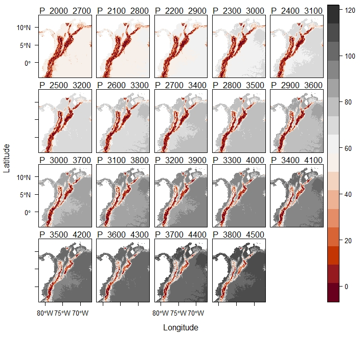

------------------------------------------------------------------------

## **1. Introduction**

In this analysis, we will **reclassify a Digital Elevation Model (DEM) raster** to generate several cost rasters based on resistance to movement. The values are derived from the work of *Flantua et al.* (paramo regions), considering the different zones that occurred during the Pleistocene climatic fluctuations: **paramos** (700m), **subparamos** (200m), and **superparamos** (300m). The original DEM raster used in this analysis, in ".asc" format, is provided in the Documents section. 

-----------------------------------------------------------------------------------------------

## **2. Elevation Ranges**

The elevation ranges used for the reclassification are defined in the following list:

```{r eval=FALSE, include=TRUE}

elevation_ranges <- list(
  c(2000, 2700), c(2100, 2800), c(2200, 2900), c(2300, 3000), c(2400, 3100),
  c(2500, 3200), c(2600, 3300), c(2700, 3400), c(2800, 3500), c(2900, 3600),
  c(3000, 3700), c(3100, 3800), c(3200, 3900), c(3300, 4000), c(3400, 4100),
  c(3500, 4200), c(3600, 4300), c(3700, 4400), c(3800, 4500)
)

```

-----------------------------------------------------------------------------------------------

## **3. Loading the Elevation Raster**

First, let's load the **Digital Elevation Model (DEM) raster**. This raster will be used as the basis for our reclassification process.

```{r eval=FALSE, include=TRUE}

# Loading the required package

library(terra)

# Load the elevation raster

elevation_raster <- raster("path/to/your/elevation_raster.asc")

# Assign a coordinate reference system (CRS) to the raster
# This ensures that the geographic coordinates are correctly interpreted.

crs(elevation_raster) <- "+proj=longlat +datum=WGS84 +no_defs"

```

-----------------------------------------------------------------------------------------------

## **4. Reclassification Process**

We will now iterate over each elevation range to reclassify the DEM into cost rasters. These rasters will assign resistance values based on elevation.

```{r eval=FALSE, include=TRUE}
# Get the elevation limits from the raster (minimum and maximum)
limits <- global(elevation_raster, range, na.rm=TRUE)
lower_limit <- limits[1, 1]
upper_limit <- limits[1, 2]

# Function to generate the reclassification table
# The table contains three columns: From, To, and New
# 'From' and 'To' represent elevation ranges, and 'New' indicates the new assigned value
tabTurn <- function(x) {
  parmin <- x[1]
  parmax <- x[2]
  
  # Create a sequence of elevation ranges in steps of 100 meters
  # The minimum and maximum values from the raster are used as boundaries
  by100  <- seq(from = lower_limit, to = upper_limit, by = 100)
  From   <- c(lower_limit, by100)
  To     <- c(by100, upper_limit)
  
  # Initialize the 'New' column with NA values
  New    <- rep(NA, length(From))
  
  # Identify the indices corresponding to 'From' and 'To'
  a <- which(From <= parmin & To >= parmin)
  b <- which(From <= parmax & To >= parmax)
  
  # Assign reclassification values based on the ranges
  if (length(a) > 0 && length(b) > 0) {
    New[a:b] <- 1
    if (b + 1 <= length(New)) New[(b + 1):(b + 2)] <- c(2, 4)
    if (a - 1 >= 1) New[(a - 1):(a - 3)] <- c(2, 4, 6)
    if (a - 4 >= 1) New[1:(a - 4)] <- rev(seq(from = 7, to = 7 + ((a - 5) * 3), by = 3))
    if (b + 3 <= length(New)) New[(b + 3):length(New)] <- seq(from = 5, to = 5 + (length((b + 4):length(New)) * 3), by = 3)
  }
  
  return(data.frame(From, To, New))
}

# Create the reclassification table for each elevation range
tabs <- lapply(X = elevation_ranges, FUN = tabTurn)

# Reclassify the original raster using the generated tables
maps <- vector(mode = "list", length = length(elevation_ranges))
for (i in 1:length(elevation_ranges)) {
  maps[[i]] <- classify(elevation_raster, tabs[[i]], include.lowest = TRUE)
}

```

-----------------------------------------------------------------------------------------------

## **5. Saving the Reclassified Rasters**

Finally, we save all the reclassified rasters to a specified folder. The files are saved in GeoTIFF format.

```{r eval=FALSE, include=TRUE}

# Output directory where the TIFF files will be saved
output_dir <- "path/to/your/output/directory"

# Save each reclassified raster as a TIFF file
for (i in seq_along(elevation_ranges)) {
  # Select the current reclassified raster
  reclassified_raster <- maps[[i]]
  
  # Get the corresponding elevation range
  range_value <- elevation_ranges[[i]]
  
  # Generate the output file name using the elevation range
  output_filename <- paste0(output_dir, "/RC_", range_value[1], "_", range_value[2], ".tif")
  
  # Write the raster in GeoTIFF format
  writeRaster(reclassified_raster, filename = output_filename, format = "GTiff", overwrite = TRUE)
  
  # Print confirmation message
  cat(sprintf("File saved: %s\n", output_filename))
}

```

-----------------------------------------------------------------------------------------------

## **6. Results Visualization**

The following image shows the resulting rasters generated for different paramo elevation ranges. This visualization illustrates how the output rasters appear and how they represent various paramo zones based on the defined elevation ranges.

```{r echo=FALSE, fig.align='center', fig.cap="*Rasters generated for different paramo elevation ranges. Above each plot, the range in meters above sea level for the grass paramo strip is shown, and to the right, a bar with the costs for all rasters is included.*", out.width='65%'}

```

-----------------------------------------------------------------------------------------------

## **7. References**

Flantua, S. G. A., O'Dea, A., Onstein, R. E., Hooghiemstra, H., & Hoorn, C. (2019). The flickering connectivity system of the north Andean páramos. *Journal of Biogeography, 46*(8), 1808-1825.